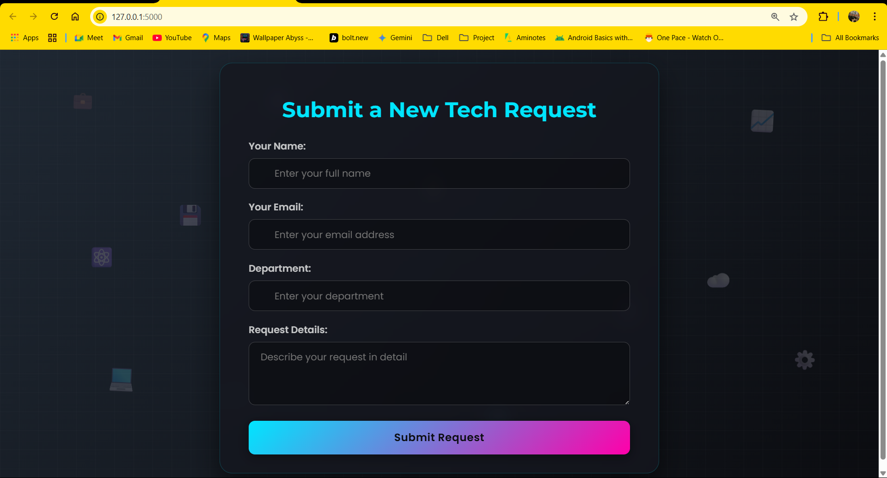

# Tech Request Automation System

This is a project I developed to implement a simple web-based system for managing tech solution requests. It allows users to submit requests through a form I designed, an IT manager to approve or reject them via email links, and logs approved requests into an Excel file.

## Features

Here are some of the key features I've included:

*   A web form for submitting tech requests.
*   Email notification to the IT Manager for approval.
*   Email confirmation to the requestor upon submission.
*   Email status update (approved/rejected) to the requestor.
*   Logging of approved requests to an Excel file (`requests.xlsx`).
*   Automatic column width adjustment in the Excel file for better readability.
*   A modern, visually appealing UI for the submission form that I put effort into designing.
*   File-based logging for application events (`app.log`) for easier debugging.

## Project Structure

I've structured the project as follows:

```
.
├── tech_request_automation/
│   ├── app.py              # Main Flask application logic I wrote
│   └── __init__.py
├── templates/
│   ├── form.html               # HTML for the request submission form I created
│   ├── approval_email.html     # HTML template for the approval email
│   ├── confirmation_email.html # HTML template for the requestor confirmation
│   └── status_update_email.html  # HTML template for the status update email
├── images/
│   └── tech_request_form.png   # Screenshot of the request form interface
├── .env                    # Stores environment variables (SMTP credentials, etc.) - YOU NEED TO CREATE THIS
├── requirements.txt        # Python dependencies I used
├── requests.xlsx           # Excel file for logging approved requests (created automatically by the app)
├── app.log                 # Application log file (created automatically by the app)
└── README.md               # This file
```

## Setup and Installation

To get this project running on your local system, you can follow these steps:

1.  **Clone the Repository (if applicable)**
    If you have this project in a Git repository I shared, clone it:
    ```bash
    git clone <repository_url>
    cd <repository_directory>
    ```
    If you have the files directly from me, navigate to the project's root directory.

2.  **Create a Virtual Environment (Recommended)**
    I recommend using a virtual environment to manage project dependencies.
    ```bash
    python -m venv venv
    ```
    Activate it:
    *   On Windows:
        ```bash
        venv\Scripts\activate
        ```
    *   On macOS/Linux:
        ```bash
        source venv/bin/activate
        ```

3.  **Install Dependencies**
    Install the required Python packages using pip (these are the ones I used):
    ```bash
    pip install -r requirements.txt
    ```

4.  **Create and Configure the `.env` File**
    In the root directory, create a file named `.env`. This is where you'll store your email server configuration.
    Add the following, replacing placeholders with your actual credentials:

    ```env
    SMTP_SERVER=your_smtp_server_address  # e.g., smtp.gmail.com
    SMTP_PORT=587                         # Or your SMTP port
    SMTP_USERNAME=your_email_address      # e.g., your.email@example.com
    SMTP_PASSWORD=your_email_password     # App-specific password if using Gmail/2FA
    IT_MANAGER_EMAIL=it_manager_email_address # Email for receiving approval requests
    ```

    **Important Security Note:**
    *   If you're using Gmail with 2FA, you'll need an "App Password". Don't use your regular password.
    *   Make sure `.env` is **never** committed to version control (add it to `.gitignore`).

5.  **Run the Application**
    Navigate to the `tech_request_automation` directory and run the Flask app I wrote:
    ```bash
    cd tech_request_automation
    python app.py
    ```
    Or from the project root:
    ```bash
    python tech_request_automation/app.py
    ```
    The application should start on `http://127.0.0.1:5000/`.

6.  **Access the Application**
    Open `http://127.0.0.1:5000/` in your browser to use the form.

## Interface Preview

Below is a preview of the Tech Request submission form interface I designed:



## How it Works

Here's the workflow I designed:

1.  A user fills out and submits the form.
2.  My Flask application receives the data.
3.  An email goes to the `IT_MANAGER_EMAIL` with approve/reject links.
4.  A confirmation email is sent to the user.
5.  When the IT Manager clicks a link:
    *   If **approved**, details (including approval date) are added to `requests.xlsx`. I made sure column widths auto-adjust.
    *   An email notifies the requestor of the decision.
6.  Application activities are logged to `app.log`.

## Files

*   **`tech_request_automation/app.py`**: Contains the backend logic I developed.
*   **`templates/`**: Holds HTML templates I created for the form and emails.
*   **`.env`**: For your sensitive SMTP configuration.
*   **`requirements.txt`**: Lists Python dependencies I used.
*   **`requests.xlsx`**: Automatically created/updated with approved requests.
*   **`app.log`**: Logs from the application, which I find useful for debugging.

## Troubleshooting

If you run into issues, here are some things I'd check:

*   **Emails not sending:** Double-check `.env` settings. Ensure your email provider allows SMTP. For Gmail, an App Password might be needed.
*   **Permission errors:** Ensure the app has write permissions for `requests.xlsx` and `app.log`.
*   **`TemplateNotFound` error:** Verify `template_folder` in `app.py` points correctly to your `templates` directory.
*   **Other issues:** `app.log` should have more details.

I hope this README helps you get the project set up!